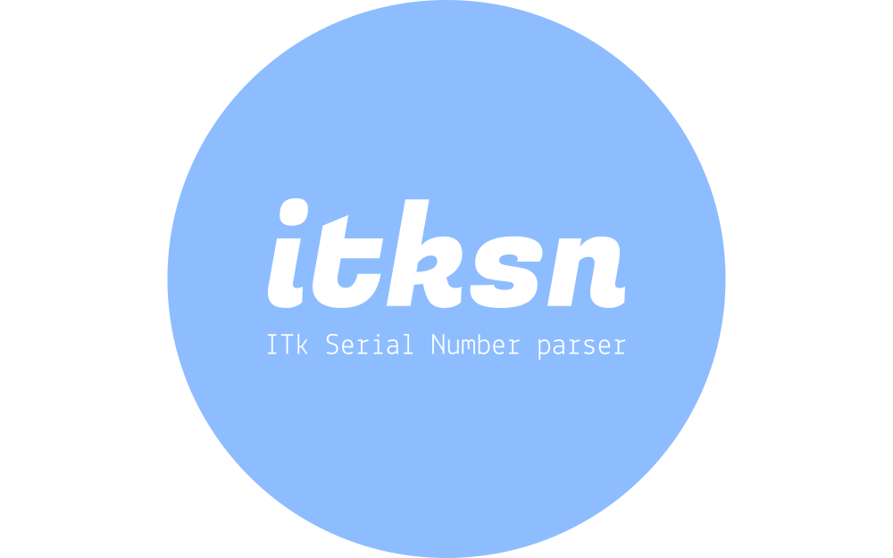

# itksn

{ align="left" width="300" role="img" }

--8<-- "README.md:badges"

---

itksn is a tool used to parse (and build) serial numbers for the ATLAS ITk
project documented at [itk.docs][].

## Features

<!-- prettier-ignore-start -->

- Multiple components supported
- Easy to contribute and extend
- Usable [CLI](cli/about.md)

<!-- prettier-ignore-end -->

## License

itksn is distributed under the terms of the [BSD-3][license-link] license.

## Navigation

Documentation for specific `MAJOR.MINOR` versions can be chosen by using the
dropdown on the top of every page. The `dev` version reflects changes that have
not yet been released.

Also, desktop readers can use special keyboard shortcuts:

| Keys                                                         | Action                          |
| ------------------------------------------------------------ | ------------------------------- |
| <ul><li><kbd>,</kbd> (comma)</li><li><kbd>p</kbd></li></ul>  | Navigate to the "previous" page |
| <ul><li><kbd>.</kbd> (period)</li><li><kbd>n</kbd></li></ul> | Navigate to the "next" page     |
| <ul><li><kbd>/</kbd></li><li><kbd>s</kbd></li></ul>          | Display the search modal        |
